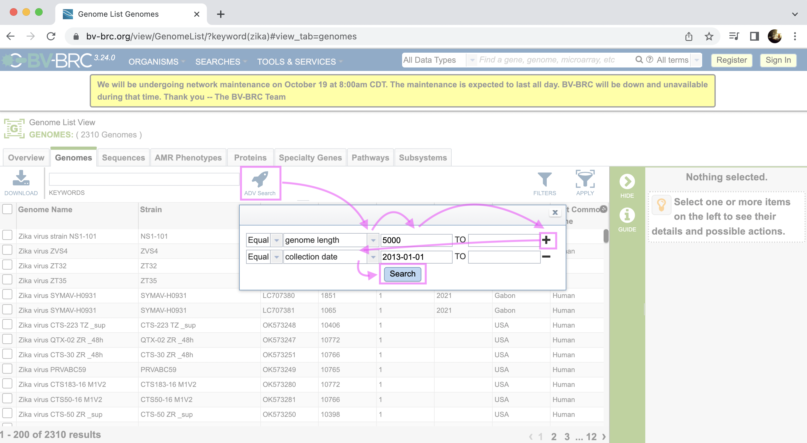
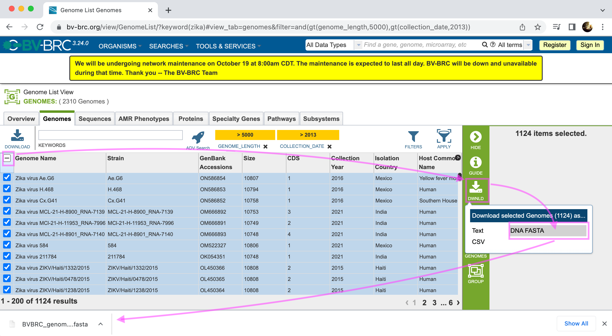
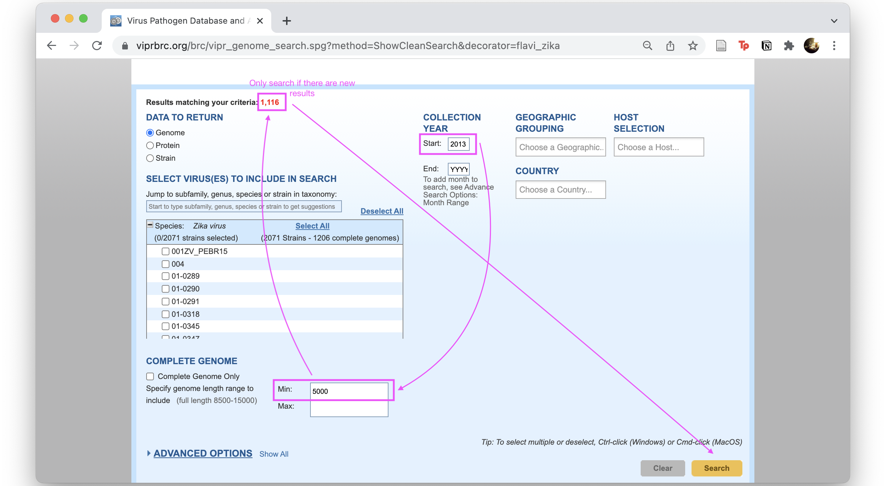
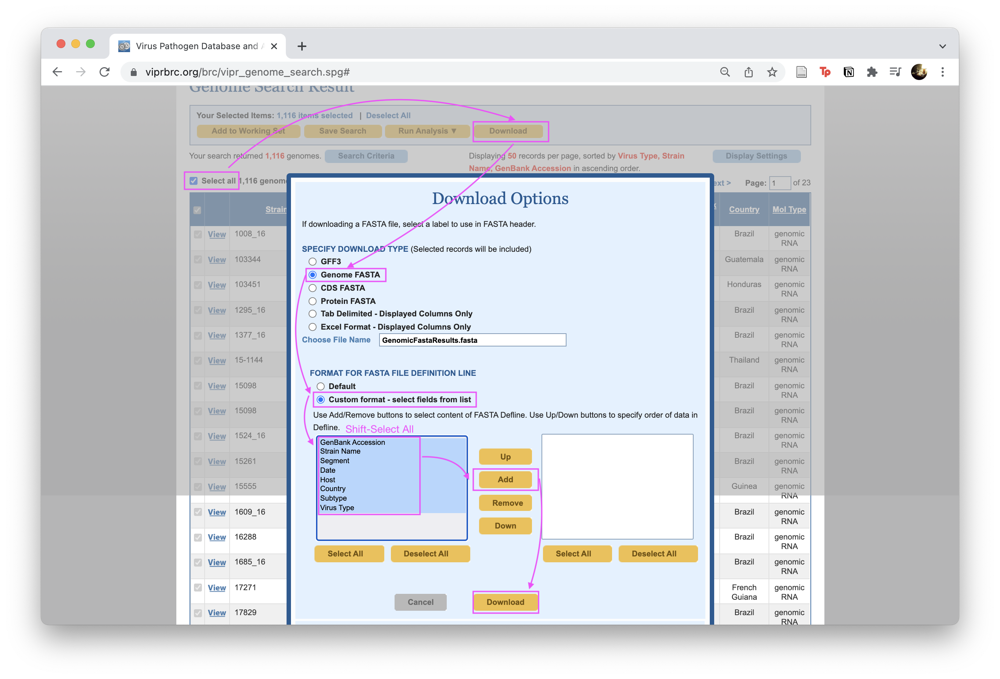
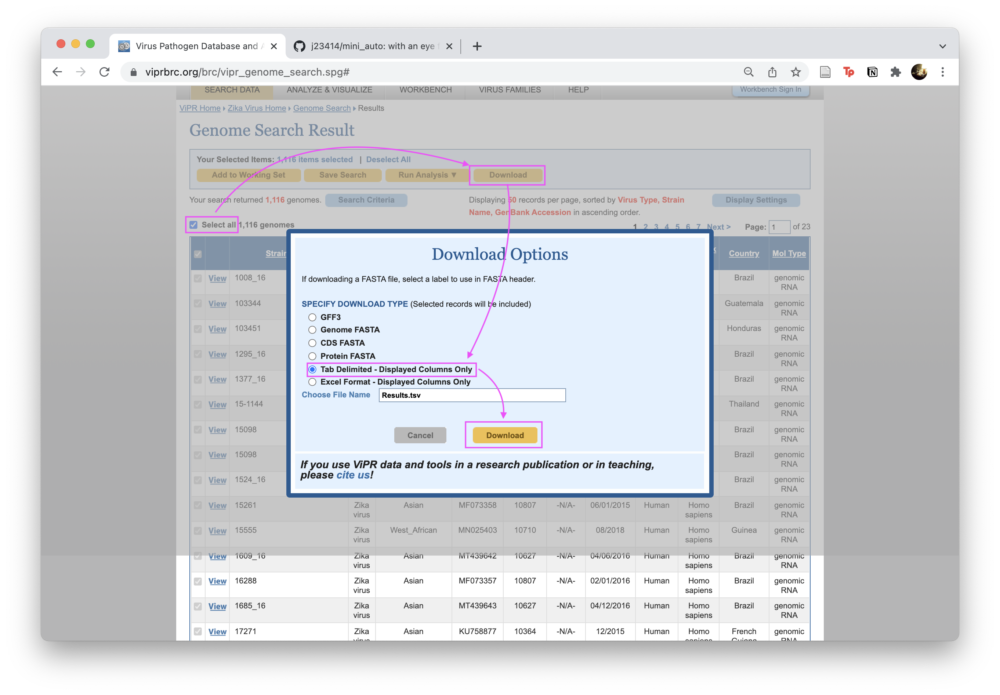
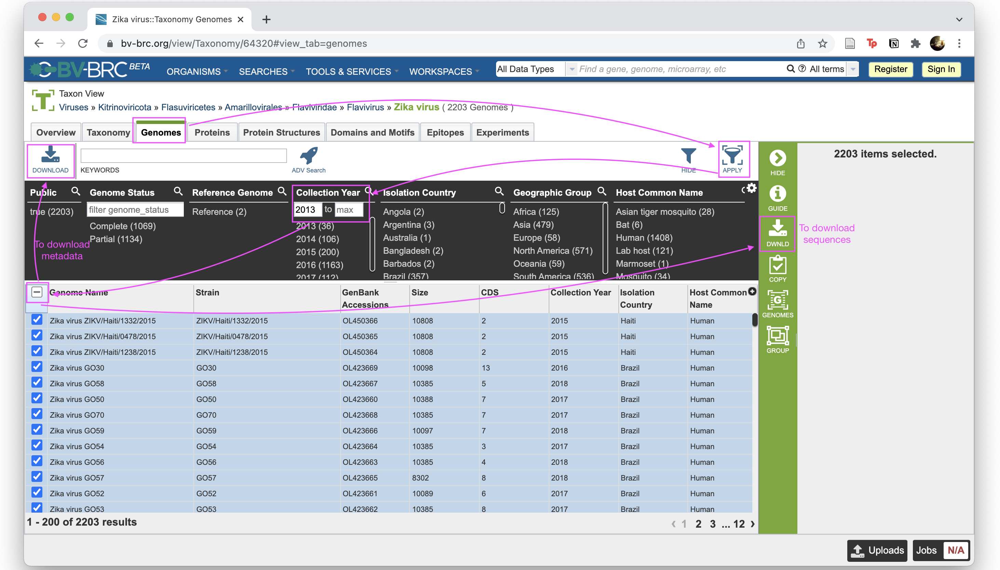

# mini_auto

### Summary

| Pathogen | Last Count | Last Update | BV-BRC |
|:--|--:|:--|:--|
| [zika](https://nextstrain.org/zika) | 1126 | 2022-09-30 | [check zika](https://www.bv-brc.org/view/Taxonomy/64320#view_tab=genomes&filter=and(gt(collection_date,2013),gt(genome_length,5000))) |
| [measles](https://nextstrain.org/measles) | 666 | 2022-08-02 | [check measles](https://www.bv-brc.org/view/GenomeList/?keyword(measles)#view_tab=genomes&filter=gt(genome_length,5000))|
| [dengue](https://nextstrain.org/dengue/denv1) | 10877 | 2020-10-10 | [check dengue](https://www.bv-brc.org/view/Taxonomy/12637#view_tab=genomes&filter=gt(genome_length,5000)) |
| [rsv]() | 3940 | |

## BV-BRC

Search for the pathogen on BV-BRC, and apply any relevant filters:



Or simply edit the url with your filters:

[https://www.bv-brc.org/view/GenomeList/?keyword(zika)#view_tab=genomes&filter=and(gt(genome_length,5000),gt(collection_date,2013))](https://www.bv-brc.org/view/GenomeList/?keyword(zika)#view_tab=genomes&filter=and(gt(genome_length,5000),gt(collection_date,2013)))

Download the fasta file, notice how the header field is set and not modifiable:



Notice how the header field is different from ViPR and not modifiable. (example from dengue)

```
head BVBRC_genome_sequence.fasta
```

```
>accn|KY829115   Dengue virus 1 isolate H.sapiens-wt/BLM/2016/MA-WGS16-006-SER, complete genome.   [Dengue virus 1 H.sapiens-wt/BLM/2016/MA-WGS16-006-SER strain Dengue virus 1/H.sapiens-wt/BLM/2016/MA-WGS16-006-SER | 11053.9479]
agttgttagtctacgtggaccgacaagaacagtttcgaatcggaagcttgcttaacgtag
ttctaacagttttttattagagagcagatctctgatgaacaaccaacggaaaaagacggg
tcgaccgtctttcaatatgctgaaacgcgcgagaaaccgcgtgtcaactggttcacagtt
```

Or possibly figure out BV-BRC commandline

* https://www.bv-brc.org/docs/cli_tutorial/index.html

## ViPR (outdated)

### Instructions

With a focus on automation:

1. Pull new sequences from [VIPR Website](https://www.viprbrc.org/brc/vipr_genome_search.spg?method=ShowCleanSearch&decorator=flavi_zika):

  

2. Download formatted fasta files:

  

  You will have a `Genomic.fasta` file which will need to processed by `augur parse`.

2b. Alternatively, download the metadata and pull Genbanks manually:

  

  You will have a `Results.tsv`.
  
  ```
  # List genbanks
  cat Results.tsv | awk -F'\t' '{print $4}' > zika_gb.ids
  bin/batchFetchGB.sh zika_gb.ids > zika.gb
  bin/procGenbank.pl zika.gb > zika.fasta
  ```

<!--

## New Website

ViPR seems to be migrating to a new website. I haven't found a length filter.



```
[[ -d data ]] || mkdir data
cd data
mv ~/Downloads Results.tsv .

# List genbanks
cat Results.tsv | awk -F'\t' '{print $4}' | head -n5
GenBank Accession
MT439645
KU501216
KX262887
MT377503
...

# Fetch genbanks

# Parse genbank into fasta& metadata

# If multi segmented, merge segments; 1 line = 1 sample

# Merge genbank and ViPr metadata (add indicator column for conflicts)

# Add rules/manual curation of conflicts

# Create a cached main metadata file, (only process/pull new Genbanks)

# Call clades per sample?

# Process/subsample for Nextstrain build
```

-->
